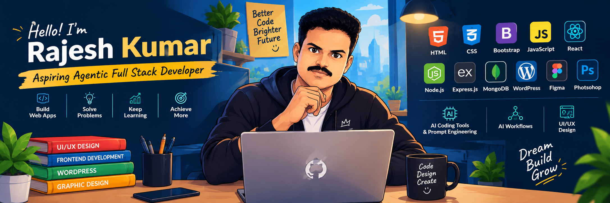

# 👋 Hi, I'm Rajesh Kumar
<div align="center">



</div>

### 🚀 Aspiring Agentic Full Stack Developer

I am a UI/UX Designer and Frontend Developer with **7+ years of experience** in web design and frontend development.

Currently, I am learning **Full Stack Development (MERN)** and exploring **AI Coding Tools, Prompt Engineering, and AI Workflows**.

---

## 🧑‍💻 About Me

- 🎨 UI/UX Designer with 7+ years of experience
- 💻 Frontend Web Developer
- 🌐 WordPress Frontend Designer
- 🚀 Currently learning Agentic Full Stack Development
- 🤖 Learning AI Coding Tools & Prompt Engineering
- 📚 Improving my JavaScript, React and Node.js skills
- 🎯 Goal: Become an Agentic Full Stack Developer

---

## 🛠️ Tech Stack

### Frontend
<p>
  
  
  
  
  
</p>

### Backend & Database
<p>
  
  
  
</p>

### AI & Development
<p>
  
  
  
</p>

### Design & CMS
<p>
  
  
  
</p>

---

### 🌐 Client Website Projects & Live Deployments

| Category | Project Name | Tech Stack | Live Demo |
| :--- | :--- | :--- | :---: |
| **Fashion Store** | Allison Exports | HTML5, CSS3, WordPress | [🔗 View Site](https://www.allisonexports.com) |
| **Hotel Booking** | KKR Residency | HTML5, CSS3, WordPress | [🔗 View Site](https://www.kkrresidency.com) |
| **Hotel Booking** | Azhagap Paresidential | HTML5, CSS3, WordPress | [🔗 View Site](https://www.azhagapparesidential.com) |
| **Hotel Booking** | The Well Guest House | HTML5, CSS3, WordPress | [🔗 View Site](https://thewellguesthouse.com) |
| **Industrial & Manufacturing** | Murugappa Infra | HTML5, CSS3, WordPress | [🔗 View Site](https://murugappainfra.com/) |
| **Industrial & Manufacturing** | Baracha Traders | HTML5, CSS3, WordPress | [🔗 View Site](https://www.barachatraders.com) |
| **Industrial & Manufacturing** | APS Builders | HTML5, CSS3, WordPress | [🔗 View Site](https://apsbuilders.in) |
| **Industrial & Manufacturing** | K2S Facility Management | HTML5, CSS3, WordPress | [🔗 View Site](https://www.k2sfm.com) |
| **Industrial & Manufacturing** | K2S Solar | HTML5, CSS3, WordPress | [🔗 View Site](https://k2ssolar.com) |
| **Industrial & Manufacturing** | Saifire Protection | HTML5, CSS3, WordPress | [🔗 View Site](https://saifireprotection.com) |
| **Education** | Faras | HTML5, CSS3, WordPress | [🔗 View Site](https://faras.in) |
| **Food** | KKK Seafood | HTML5, CSS3, WordPress | [🔗 View Site](https://www.kkkseafood.com) |
| **Taxi Booking Website** | VK Drop Taxi | HTML5, CSS3, WordPress | [🔗 View Site](https://vkdroptaxi.in) |
| **Taxi Booking Website** | Chennai City Cab | HTML5, CSS3, WordPress | [🔗 View Site](https://chennaicitycab.com) |
| **Taxi Booking Website** | Marks Trans Info | HTML5, CSS3, WordPress | [🔗 View Site](https://www.markstransinfo.com) |
| **Trust** | Shelin Seva Trust | HTML5, CSS3, WordPress | [🔗 View Site](https://shelinsevatrust.com) |
| **Trust** | AMTK Trust | HTML5, CSS3, WordPress | [🔗 View Site](https://www.amtktrust.com) |

---
## 📊 GitHub Stats

<p align="center">
  
  
</p>

---

## 🚀 Current Learning

```text
HTML & CSS
     ↓
JavaScript
     ↓
React
     ↓
Node.js + Express.js
     ↓
MongoDB
     ↓
AI Coding Tools
     ↓
Prompt Engineering
     ↓
AI Workflows
     ↓
Agentic Full Stack Development
```
---
## 📬 Connect With Me

<p align="left">
  <a href="https://linkedin.com/in/your-profile" target="_blank">
    
  </a>
  <a href="mailto:your-email@example.com">
    
  </a>
  <a href="https://yourportfolio.com" target="_blank">
    
  </a>
</p>

---
